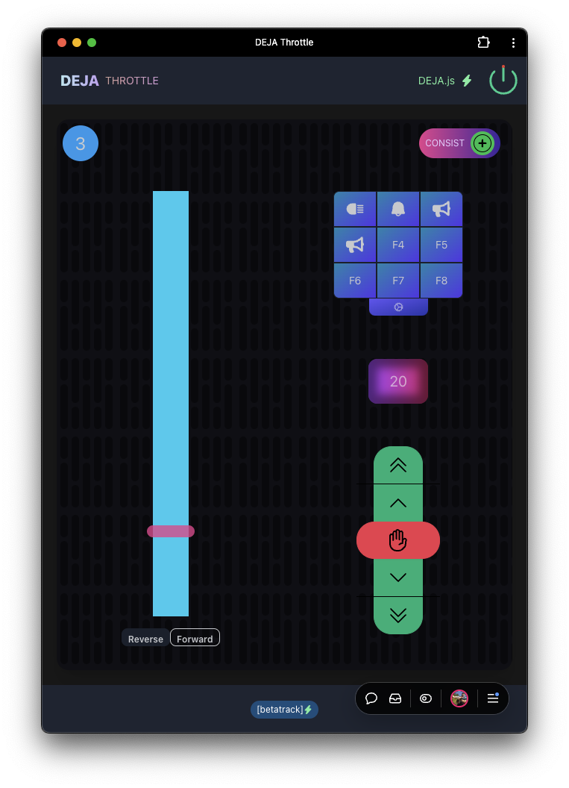
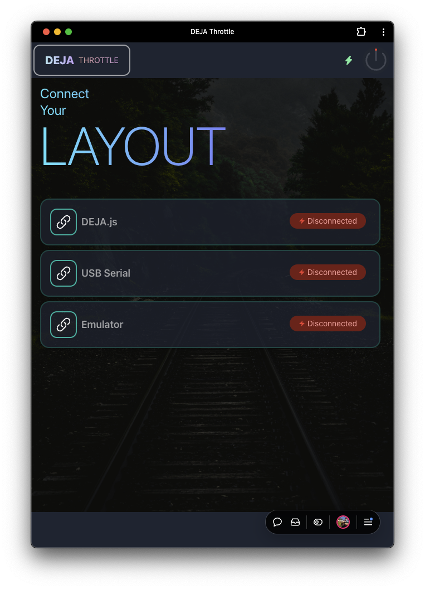
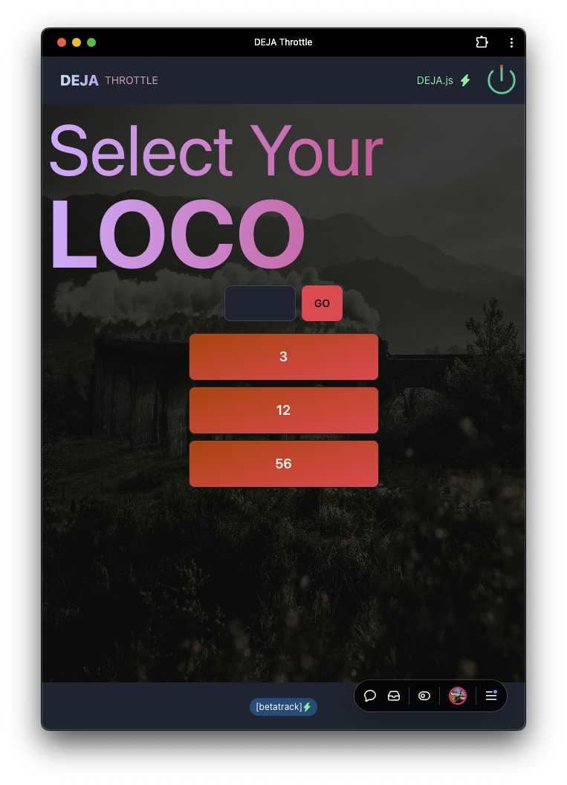
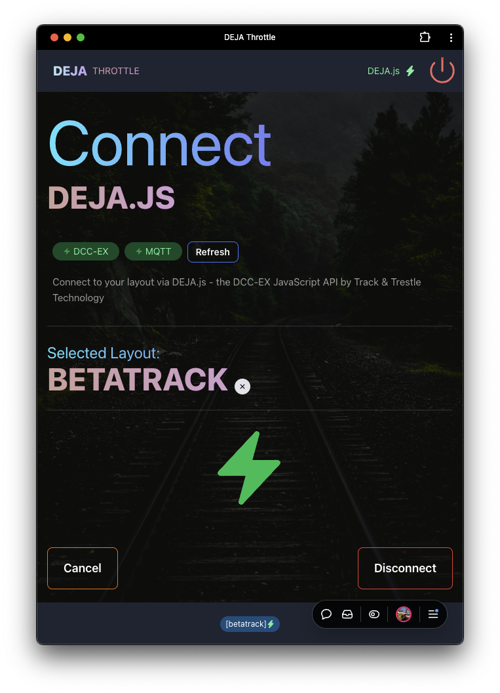

# 🚂 DEJA Throttle - The Ultimate Train Control Experience

> 🌟 **Current Release: v0.1.0-alpha** 🌟

**Transform your device into a professional locomotive throttle!** Vue.js 3 Web App to control DCC locomotives with [🛰️ DEJA.js](https://github.com/jmcdannel/DEJA.js) and [DCC-EX EX-CommandStation](https://dcc-ex.com/ex-commandstation/index.html).

<p align="center">
  
  
  
  
</p>

---

## 🚀 Try It Now!

🌟 **[Open DEJA Throttle](https://deja-throttle.vercel.app/)** 🌟

Take 'er for a spin! 🚗 Open in Chrome on a computer 💻 with a USB DCC-EX CommandStation, run trains 🚂! Or, try emulator mode to see how easy it is. Better yet, go big-brain 🧠, dive in and install [🛰️ DEJA.js](https://github.com/jmcdannel/DEJA.js) SERVER on a PC/MAC/Linux/Pi 💻 connected to a DCC-EX CommandStation and unleash all the potential of the [DEJA Cloud](https://github.com/jmcdannel/DEJA.js) and instant wireless throttle control 📲 on any modern device with a browser.

---

## ✨ Amazing Features

- 🤯 **Emulator Mode Available** - Try it without any hardware!
- 🧠 **Install as PWA** - Click YES for premium app experience
- 💄 **Beautiful UI** - Dark Mode FTW, designed for railroad operators
- 🔥 **Blazing Fast** - Hosted on Vercel, frequent deployments, PRs welcome
- 🟪 **Chonky A$$ Buttons** - Perfect for fat fingers and panic stops
- 🎮 **Multiple Connection Types** - USB, DEJA.js, or Emulator
- 📱 **Cross-Platform** - Works on phones, tablets, and computers
- 🚨 **Emergency Stop** - Big red button for instant train stopping
- 🎛️ **Professional Controls** - Speed, direction, and function management
- 💾 **Locomotive Memory** - Remembers your favorite engines

---

## 🚀 Getting Started

### 📦 Connection Options

There are **3 exciting ways** to use DEJA Throttle:

#### 1. 🛰️ DEJA.js Connection (✨ **Preferred** ✨)

**🎯 The Ultimate Experience!**

- 📦 Install and configure [🛰️ DEJA.js](https://github.com/jmcdannel/DEJA.js) on a 💻 PC/Mac/Linux/Pi
- 🔌 Connect via USB to a [DCC-EX EX-CommandStation](https://dcc-ex.com/ex-commandstation/index.html) 
- 🌐 Open [DEJA Throttle](https://deja-throttle.vercel.app/) in any modern browser 🔥
- ⚙️ Select "DEJA.js" from the connection menu
- 🏷️ Enter your layout name from `.env` file `[LAYOUT_ID]`
- 🔌 Select the USB Port for your DCC-EX Command Station
- 🎯 **Drive Trains & Rule Your Railroad Empire!** 👑

#### 2. 🔗 Direct USB Connection (Limited)

**💻 Computer-Only Control**

- ⚠️ **Requires Chrome browser** - No other browsers supported
- 💻 Must be on PC/Mac/Linux/Pi with **direct** USB connection
- 📱 Won't work on phones/tablets (use ✨[🛰️ DEJA.js](https://github.com/jmcdannel/DEJA.js)✨ for mobile!)
- 🌐 Open [DEJA Throttle](https://deja-throttle.vercel.app/)
- ⚙️ Select "USB Serial" from connection menu
- 🔌 Click "Connect" and choose your DCC-EX USB port
- 🎯 **Drive Trains!** 🚂

#### 3. 🎪 Emulator Mode (Demo & Fun)

**🎮 Try Before You Buy!**

- 🌐 Open [DEJA Throttle](https://deja-throttle.vercel.app/)
- ⚙️ Select "Emulator" from connection menu
- 🔌 Click "Connect" and enter any DCC Address
- 🎯 **(Pretend to) Drive Trains!** 🚂
- ⚠️ No real communication - perfect for demos and learning!

---

## 💻 Local Development

Want to run this on your own? Fork it, clone it, PR it. Just don't sell it! 😊

```bash
# 📦 Install dependencies
pnpm install

# 🚀 Start development server
pnpm run start

# 🏗️ Build for production
pnpm run build

# 🔍 Lint and format
pnpm run lint
pnpm run format
```

---

## 🎮 How to Use

### 🚂 Basic Train Control

1. **🔌 Connect** - Choose your connection method
2. **🚂 Select Locomotive** - Enter DCC address or choose from list
3. **⚡ Control Speed** - Use slider or +/- buttons
4. **🔄 Change Direction** - Forward/reverse toggle
5. **💡 Use Functions** - Lights, horn, bell, and more
6. **🛑 Emergency Stop** - Big red button stops everything!

### 🎛️ Advanced Features

#### 🚂 Locomotive Functions
- **💡 F0** - Headlight control
- **🔔 F1** - Bell activation
- **📯 F2** - Horn/whistle
- **🚨 F3-F28** - Custom functions (smoke, couplers, etc.)

#### ⚙️ Throttle Settings
- **🎨 Theme Selection** - Light/dark mode
- **🔊 Sound Effects** - Button click feedback
- **📱 Layout Options** - Customize button arrangement
- **💾 Locomotive Presets** - Save favorite engines

---

## 🗺️ Exciting Roadmap

### 🔥 Coming Soon
- ☁️ **DEJA Cloud Integration** - Multi-layout management
- 🔀 **Turnout Control** - Switch track sections remotely
- 💡 **Output Control** - Manage lights and effects
- 🚂 **Multiple Throttles** - Control several trains at once
- 📊 **Train Status Reading** - Live feedback from DCC-EX

### 🌟 Future Dreams
- 🎨 **Custom Themes** - Personalize your interface
- 📱 **Native Mobile Apps** - iOS and Android versions
- 🎮 **Gamepad Support** - Use controllers for train control
- 🤖 **AI Assistance** - Smart train scheduling
- 🎪 **AR Integration** - Augmented reality controls

---

## 🛠️ Built With Amazing Tech

[![Vue][Vue.js]][Vue-url]
[![TypeScript][TypeScript]][TypeScript-url]
[![Tailwind][Tailwind.css]][Tailwind-url]
[![DaisyUI][DaisyUI]][DaisyUI-url]
[![MQTT][MQTT.js]][MQTT-url]
[![Vite][Vite]][Vite-url]
[![pnpm][pnpm]][pnpm-url]
[![ESLint][ESLint]][ESLint-url]
[![Prettier][Prettier]][Prettier-url]
[![Autoprefixer][Autoprefixer]][Autoprefixer-url]

---

## 🎯 Pro Tips

### 🚂 For Best Experience
- **📱 Install as App** - Add to home screen for native feel
- **🌙 Use Dark Mode** - Easier on eyes during long sessions
- **🔊 Enable Sound** - Audio feedback enhances control
- **💾 Save Locomotives** - Build your personal roster

### 🛡️ Safety First
- **🚨 Know Emergency Stop** - Big red button stops all trains
- **👀 Watch Your Trains** - Visual confirmation prevents accidents
- **⚡ Start Slow** - Low speeds when testing new locomotives
- **🔌 Check Connections** - Verify before operating

---

## 🆘 Troubleshooting

### 🔧 Common Issues

| Problem | Solution |
|---------|----------|
| 🚫 **Can't Connect** | Check USB cable and DCC-EX power |
| 🐌 **Slow Response** | Verify DEJA.js server is running |
| 🔇 **No Sound** | Enable audio in browser settings |
| 📱 **Mobile Issues** | Use DEJA.js server for mobile access |

### 💡 Quick Fixes
- **🔄 Refresh Browser** - Solves most connection issues
- **🔌 Check USB Port** - Try different ports if needed
- **🚀 Restart DEJA.js** - Server restart often helps
- **🧹 Clear Cache** - Browser cache can cause problems

---

## 🤝 Contributing

We love contributions! 💖

### 🛠️ How to Help
1. 🍴 **Fork the Repository** - Make it your own
2. 🌿 **Create Feature Branch** - `git checkout -b feature/amazing-feature`
3. 🎨 **Make Changes** - Add your awesome improvements
4. 📝 **Write Tests** - Ensure quality code
5. 📤 **Submit Pull Request** - Share your work with the world

### 🎯 What We Need
- 🐛 **Bug Reports** - Help us find and fix issues
- ✨ **Feature Ideas** - Suggest cool new capabilities
- 📚 **Documentation** - Improve guides and examples
- 🎨 **UI/UX Improvements** - Make it even more beautiful

---

<!-- MARKDOWN LINKS & IMAGES -->
<!-- https://www.markdownguide.org/basic-syntax/#reference-style-links -->
[contributors-shield]: https://img.shields.io/github/contributors/github_username/repo_name.svg?style=for-the-badge
[contributors-url]: https://github.com/github_username/repo_name/graphs/contributors
[forks-shield]: https://img.shields.io/github/forks/github_username/repo_name.svg?style=for-the-badge
[forks-url]: https://github.com/github_username/repo_name/network/members
[stars-shield]: https://img.shields.io/github/stars/github_username/repo_name.svg?style=for-the-badge
[stars-url]: https://github.com/github_username/repo_name/stargazers
[issues-shield]: https://img.shields.io/github/issues/github_username/repo_name.svg?style=for-the-badge
[issues-url]: https://github.com/github_username/repo_name/issues
[license-shield]: https://img.shields.io/github/license/github_username/repo_name.svg?style=for-the-badge
[license-url]: https://github.com/github_username/repo_name/blob/master/LICENSE.txt
[linkedin-shield]: https://img.shields.io/badge/-LinkedIn-black.svg?style=for-the-badge&logo=linkedin&colorB=555
[linkedin-url]: https://linkedin.com/in/linkedin_username
[product-screenshot]: images/screenshot.png
[Vue.js]: https://img.shields.io/badge/Vue.js-35495E?style=for-the-badge&logo=vuedotjs&logoColor=4FC08D
[Vue-url]: https://vuejs.org/
[Tailwind.css]: https://img.shields.io/badge/Tailwind-06B6D4?style=for-the-badge&logo=tailwindcss&logoColor=white
[Tailwind-url]: https://tailwindcss.com/
[MQTT.js]: https://img.shields.io/badge/MQTT-660066?style=for-the-badge&logo=mqtt&logoColor=white
[MQTT-url]: https://mqtt.org/
[pnpm]: https://img.shields.io/badge/pnpm-F69220?style=for-the-badge&logo=pnpm&logoColor=white
[pnpm-url]: https://pnpm.io/
[TypeScript]: https://img.shields.io/badge/Typescript-3178C6?style=for-the-badge&logo=typescript&logoColor=white
[TypeScript-url]: https://www.typescriptlang.org/
[DaisyUI]: https://img.shields.io/badge/daisyUI-5A0EF8?style=for-the-badge&logo=daisyui&logoColor=white
[DaisyUI-url]: https://daisyui.com/
[ESLint]: https://img.shields.io/badge/ESLint-4B32C3?style=for-the-badge&logo=eslint&logoColor=white
[ESLint-url]: https://eslint.org/
[Prettier]: https://img.shields.io/badge/Prettier-F7B93E?style=for-the-badge&logo=prettier&logoColor=white
[Prettier-url]: https://prettier.io/
[Vite]: https://img.shields.io/badge/Vite-646CFF?style=for-the-badge&logo=vite&logoColor=white
[Vite-url]: https://vitejs.dev/
[Autoprefixer]: https://img.shields.io/badge/Autoprefixer-DD3735?style=for-the-badge&logo=autoprefixer&logoColor=white
[Autoprefixer-url]: https://autoprefixer.github.io/

---

<p align="center">
  <strong>🚂 All Aboard the DEJA Express! 🎉</strong><br>
  <em>Built with ❤️ for railroad enthusiasts everywhere</em>
</p>

<!-- 🧠💄🦩🔥✨🎯📲✅🟪📣🚗🚂🚆🗺️ -->